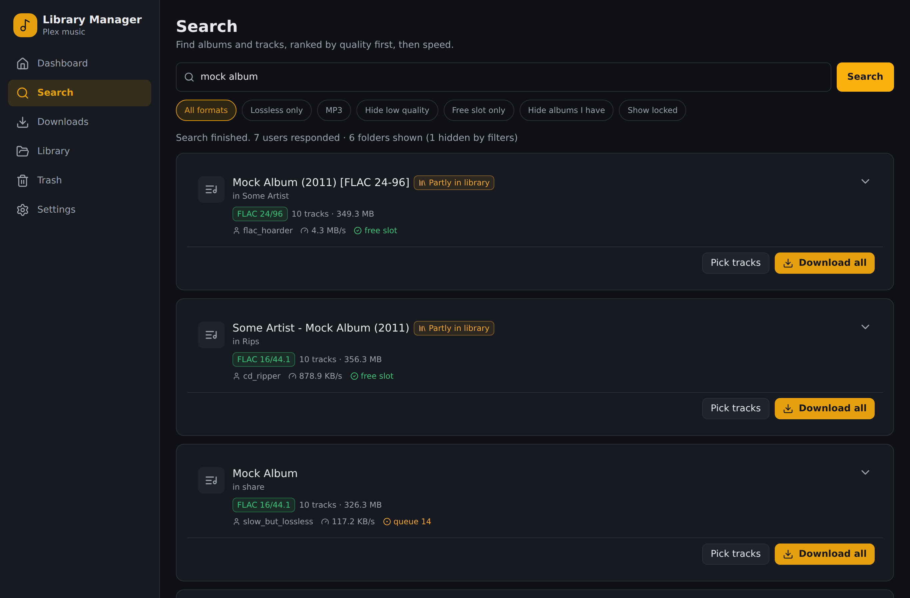
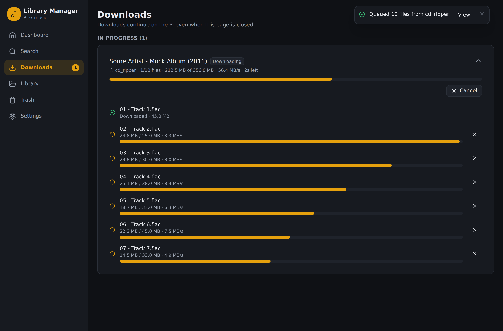
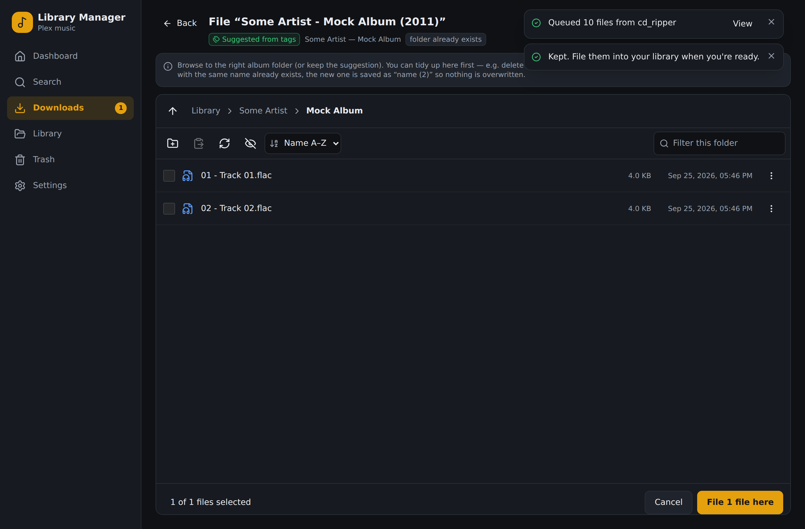
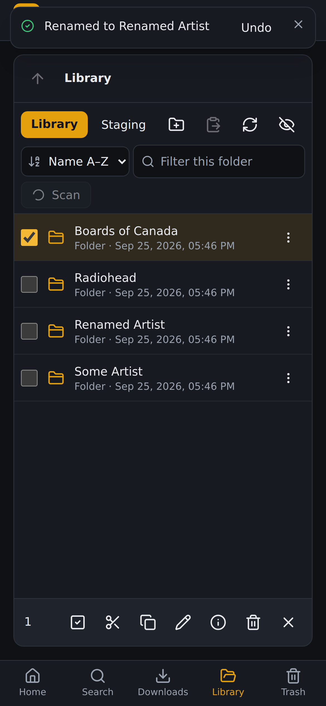

# Plex Library Manager

A self-hosted dashboard for the Plex music library on a Raspberry Pi. It works on both desktop and phone. With it you can:

- **Search Soulseek.** Results are ranked by **quality first** (FLAC, then MP3 320/V0, then lower bitrates), then by speed (free slot, upload speed, queue). They are grouped into album cards by user and folder, and each card is flagged if you **already have that album**. You can download a whole folder or pick individual tracks.
- **Browse Spotify's catalog (optional).** Search artists, albums and songs, open an artist's albums, singles and compilations, or paste a Spotify link. **Find on Soulseek** searches for that exact release and shows how many of its tracks each result folder has, e.g. "12/13 tracks match". It uses your own Spotify developer app for metadata only, with cached and paced requests.
- **Download.** Progress is live and per file. When you **cancel**, you choose to *keep the finished files* or *delete them*. Failed files can be retried. Downloads keep running on the Pi after you close the browser.
- **File downloads into the library.** A built-in **file explorer** opens at a suggested `Artist/Album` folder, based on the files' tags. You can tidy that folder first (for example, delete the old tracks from a half-downloaded album), then press **File here**. Nothing gets overwritten: a file with the same name is saved as `name (2)`.
- **Trigger Plex scans.** Use the **Scan library** button, or let the app run a scan of just that album folder automatically after filing.
- **Manage the library by hand at any time.** The explorer supports new folder, rename, cut/copy/paste, drag-and-drop, and delete to a **Trash** you can restore from. The Trash auto-empties after 30 days.

| Search | Downloads | Filing into the library | Phone |
|---|---|---|---|
|  |  |  |  |

**→ Installation: [docs/SETUP.md](docs/SETUP.md)** covers Docker Compose, slskd, Plex token, permissions and Tailscale.

## How it fits together

```
Phone / laptop ──Tailscale HTTPS──▶ Library Manager (Docker, :8080 on localhost)
                                      ├─ slskd REST API  → Soulseek search & downloads → /mnt/usb/.lm/staging
                                      ├─ Plex HTTP API   → scans, "already in library" index
                                      └─ USB drive       → /mnt/usb/Music (library), .lm/staging, .lm/trash
```

- **Backend:** Python / FastAPI + SQLite (`backend/`). It includes a path-jailed file service, the trash, the slskd and Plex clients, a download poller, and Server-Sent Events for live updates.
- **Frontend:** React + TypeScript + Tailwind (`frontend/`). It can be installed as a home-screen app, and it follows the system light/dark theme.
- **Search sources are pluggable** (`backend/app/providers/`). Soulseek is the only download source. The Spotify tab (`backend/app/services/spotify.py`, `catalog.py`) is a metadata catalog that feeds Soulseek searches. All third-party calls go through `services/ratelimit.py`: paced, concurrency-capped, and backing off on `Retry-After`.

### Safety features

- Every path from the browser is checked against the allowed folders (Library and Staging). Symlinks that point outside those folders are ignored.
- All writes stop if the USB drive isn't mounted (`MOUNT_MARKER`), so nothing ever fills the SD card by accident.
- Deleting and replacing always goes through the Trash, and moves, renames and deletes have a 10-second **Undo**.
- Folders that slskd is still writing to are locked against explorer operations.
- There is a single admin account: the password is hashed with Argon2id, the session cookie is HttpOnly and SameSite=Strict, logins are rate-limited, and changes require a CSRF header. The app is exposed only through Tailscale. The login page is optional (`AUTH_ENABLED=false`) for instances that already sit behind their own trusted access control.

## Development

```bash
# Backend (Python 3.11+)
cd backend && python -m venv .venv && . .venv/bin/activate
pip install -e ".[dev]" && pytest && ruff check .

# Frontend
cd frontend && npm ci && npm test && npm run build

# Run everything locally against fake slskd + Plex services
pip install -e "backend[dev]"
MOCK_STAGING=/tmp/lm/usb/.lm/staging uvicorn devtools.mock_services:app --port 5031 &
# point SLSKD_URL and PLEX_URL at http://127.0.0.1:5031 and the roots at /tmp/lm/usb/...,
# set COOKIE_SECURE=false, then:
(cd backend && uvicorn app.main:app --port 8080) &
(cd frontend && npm run dev)            # http://localhost:5173, proxies /api to :8080

# End-to-end browser test (needs the servers above + a built frontend served by the backend)
node e2e/smoke.mjs
```

## Roadmap

- Push notifications (ntfy / Web Push) when downloads finish or fail
- Upload from / download to the device, in-browser audio preview
